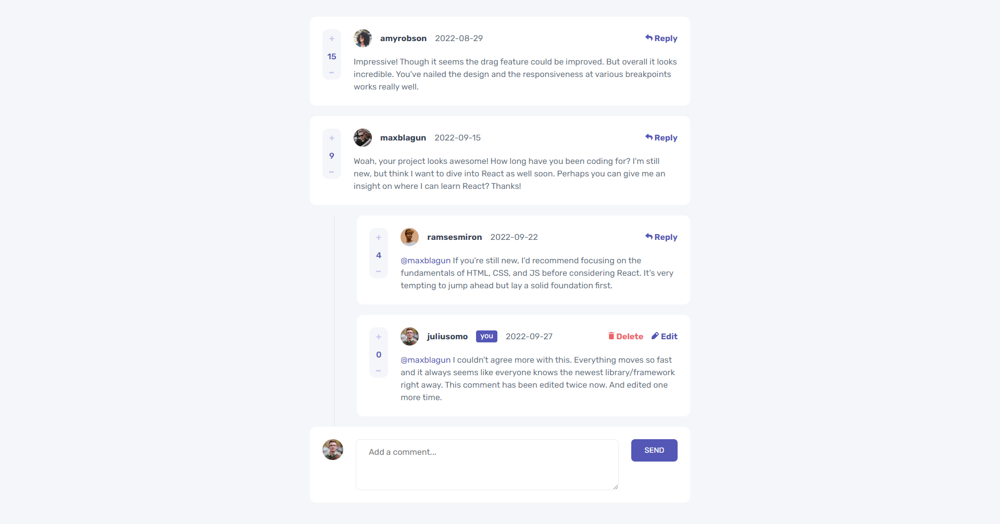
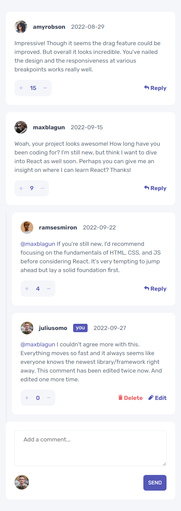

# Frontend Mentor - Interactive comments section solution

This is a solution to the [Interactive comments section challenge on Frontend Mentor](https://www.frontendmentor.io/challenges/interactive-comments-section-iG1RugEG9). Frontend Mentor challenges help you improve your coding skills by building realistic projects. 

## Table of contents

- [Overview](#overview)
  - [The challenge](#the-challenge)
  - [Screenshot](#screenshot)
  - [Links](#links)
- [My process](#my-process)
  - [Built with](#built-with)
  - [What I learned](#what-i-learned)
  - [Continued development](#continued-development)
  - [Useful resources](#useful-resources)
- [Author](#author)

**Note: Delete this note and update the table of contents based on what sections you keep.**

## Overview

### The challenge

Users should be able to:

- View the optimal layout for the app depending on their device's screen size
- See hover states for all interactive elements on the page
- Create, Read, Update, and Delete comments and replies
- Upvote and downvote comments
- **Bonus**: If you're building a purely front-end project, use `localStorage` to save the current state in the browser that persists when the browser is refreshed.
- **Bonus**: Instead of using the `createdAt` strings from the `data.json` file, try using timestamps and dynamically track the time since the comment or reply was posted.

### Screenshot

Desktop:

Mobile:

### Links

- Solution URL: [Add solution URL here](https://your-solution-url.com)
- Live Site URL: [MarkVanweersch.nl](https://www.markvanweersch.nl/projects/interactive-comments-section/)

## My process

### Built with

- Semantic HTML5 markup
- Vanilla JS
- PHP
- MySQL
- CSS custom properties
- Flexbox
- CSS Grid

### What I learned

This was the first full-stack web application I built. For this I learned how to use set up a local webserver running PHP and MySQL. I learned what PHP and MySQL are and how they can be used to make a web application. What I mostly learned was the fundamentals of PHP and MySQL, as well as getting better at manipulating the DOM with JavaScript.

### Continued development

I want to learn more about PHP and MySQL. Using these together with JS, you can make some awesome web apps.

### Useful resources

- [w3schools](https://www.w3schools.com) - This helped me for learning PHP and MySQL as well as generally looking up syntaxes.
- [Dani Krossing](https://www.youtube.com/c/TheCharmefis) - Dani has a tutorial series on how to work with PHP and MySQL. For this project and my personal portfolio I learned a lot from him.

## Author

- Website - [Mark Vanweersch](https://www.markvanweersch.nl)
- Frontend Mentor - [@MarkVanweersch](https://www.frontendmentor.io/profile/markvanweersch)
